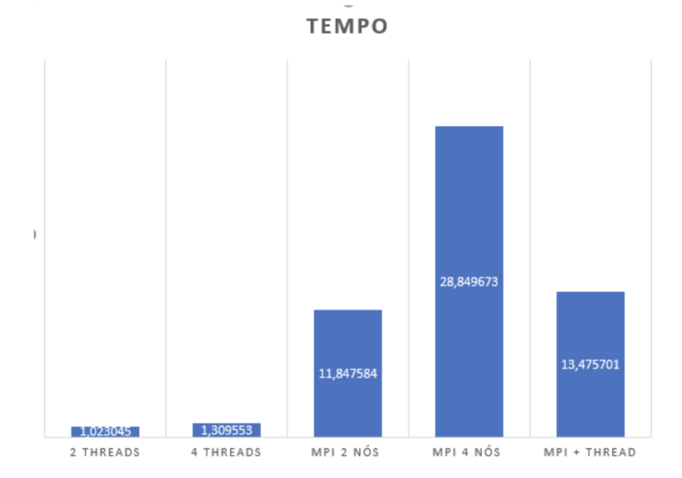

# MPI-threads-lab
Versions of a program that makes some operation in a matrix and adding it.
`#define matrix_size 16000`

## Approaches 
`duo_thread.c` - single node with 2 threads sharing the task. 
`quad_thread.c` - single node with 4 threads sharing the task. 
 
`MPI_2nodes.c` - 2 single threaded nodes doing the task. 
`MPI_4nodes.c` - 4 single threaded nodes doing the task. 
 
`MPI_Thread.c` - 2 nodes with 2 threads sharing the task in each node. 

## Benchmarking

## Conclusion
The results are not intuitive, because I wouldn't imagine that using 2 nodes with 2 threads on each would take more time than just using 2 nodes single threaded. But thinking further, We've noticed that the operations are way to easy to compute that the overhead created by the 2 threads take the longest space of time.

